# OpenMAIC 详细设计文档

> **Open Multi-Agent Interactive Classroom** — 多智能体交互课堂平台
> 版本: 0.1.0 | 技术栈: Next.js 16 + React 19 + TypeScript 5 + LangGraph 1.1 + Tailwind CSS 4

---

## 1. 项目概述

OpenMAIC 是一个开源的 AI 多智能体交互课堂平台。用户只需输入一个学习主题或上传参考材料，系统即可自动生成包含幻灯片、测验、互动模拟和项目制学习（PBL）的完整课堂体验。AI 教师和 AI 同学能够在实时讨论中发言、在白板上绘图并与用户互动。

### 1.1 核心亮点

| 特性 | 描述 |
|------|------|
| 一键生成课堂 | 输入主题或附加材料，AI 自动构建完整课程 |
| 多智能体课堂 | AI 教师和同伴实时讲授、讨论和互动 |
| 丰富场景类型 | 幻灯片、测验、交互式 HTML 模拟、PBL |
| 白板 & TTS | 智能体可绘制图表、书写公式并语音讲解 |
| 导出功能 | 可导出 `.pptx` 和 `.html` 文件 |
| OpenClaw 集成 | 通过飞书/Slack/Telegram 等消息应用生成课堂 |

---

## 2. 系统架构总览

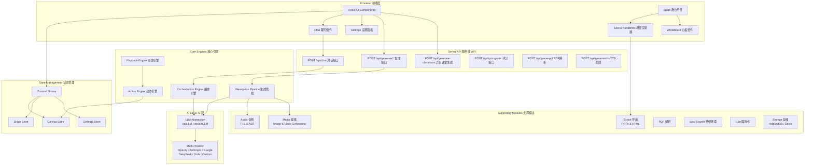

---

## 3. 项目目录结构

```
OpenMAIC/
├── app/                        # Next.js App Router
│   ├── api/                    #   服务端 API 路由 (~18 个端点)
│   │   ├── generate/           #     场景生成管线 (大纲/内容/图片/TTS…)
│   │   ├── generate-classroom/ #     异步课堂任务提交 + 轮询
│   │   ├── chat/               #     多智能体讨论 (SSE 流式传输)
│   │   ├── pbl/                #     项目制学习端点
│   │   └── ...                 #     quiz-grade, parse-pdf, web-search 等
│   ├── classroom/[id]/         #   课堂回放页面
│   └── page.tsx                #   首页 (生成输入界面)
│
├── lib/                        # 核心业务逻辑
│   ├── generation/             #   两阶段课程生成管线
│   ├── orchestration/          #   LangGraph 多智能体编排 (Director Graph)
│   ├── playback/               #   回放状态机 (idle → playing → live)
│   ├── action/                 #   动作执行引擎 (speech, whiteboard, effects)
│   ├── ai/                     #   LLM 提供者抽象层
│   ├── api/                    #   Stage API 门面 (slide/canvas/scene 操作)
│   ├── store/                  #   Zustand 状态存储
│   ├── types/                  #   集中式 TypeScript 类型定义
│   ├── audio/                  #   TTS & ASR 提供者
│   ├── media/                  #   图片 & 视频生成提供者
│   ├── export/                 #   PPTX & HTML 导出
│   ├── hooks/                  #   React 自定义 Hooks (55+)
│   ├── pbl/                    #   PBL 项目制学习
│   ├── i18n/                   #   国际化 (zh-CN, en-US)
│   └── ...                     #   prosemirror, storage, pdf, web-search, utils
│
├── components/                 # React UI 组件
│   ├── slide-renderer/         #   Canvas 幻灯片编辑器 & 渲染器
│   ├── scene-renderers/        #   Quiz, Interactive, PBL 场景渲染器
│   ├── generation/             #   课程生成工具栏 & 进度
│   ├── chat/                   #   聊天区域 & 会话管理
│   ├── settings/               #   设置面板 (providers, TTS, ASR, media…)
│   ├── whiteboard/             #   SVG 白板绘图
│   ├── agent/                  #   Agent 头像、配置、信息栏
│   ├── ui/                     #   基础 UI 组件 (shadcn/ui + Radix)
│   └── ...                     #   audio, roundtable, stage, ai-elements
│
├── packages/                   # Workspace 内部包
│   ├── pptxgenjs/              #   自定义 PowerPoint 生成
│   └── mathml2omml/            #   MathML → Office Math 转换
│
├── configs/                    # 共享常量 (shapes, fonts, hotkeys, themes…)
└── public/                     # 静态资源 (logos, avatars)
```

---

## 4. 核心流程图

### 4.1 整体业务流程

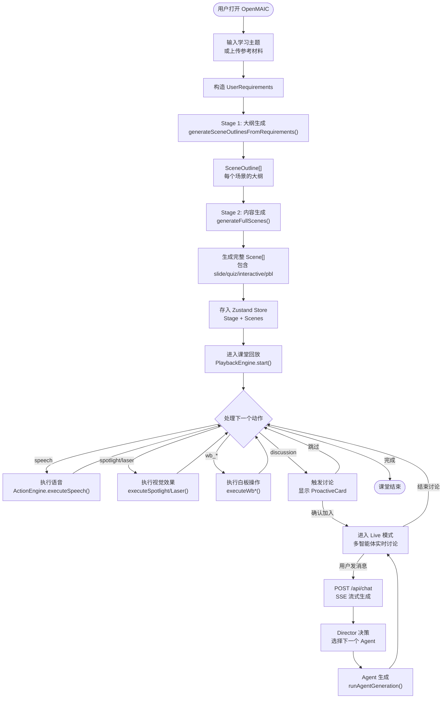

### 4.2 两阶段生成管线详细流程

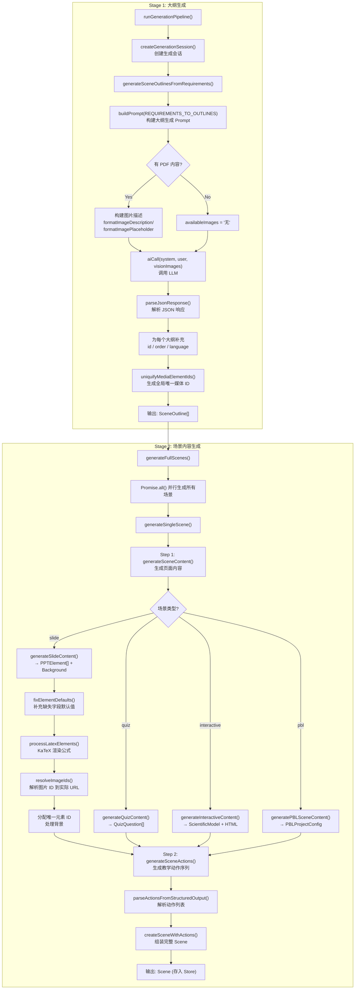

### 4.3 多智能体编排流程 (Director Graph)

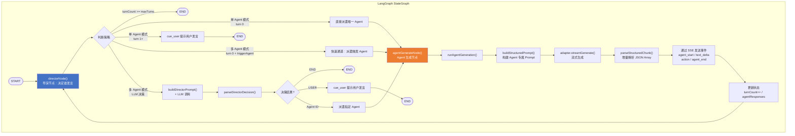

### 4.4 回放引擎状态机

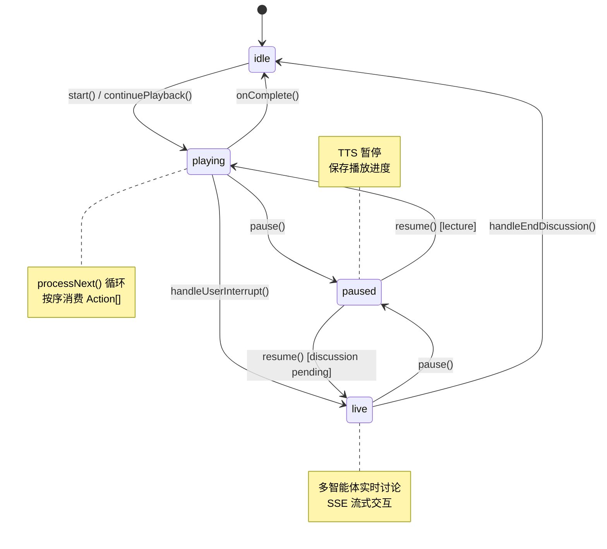

### 4.5 动作引擎执行流程

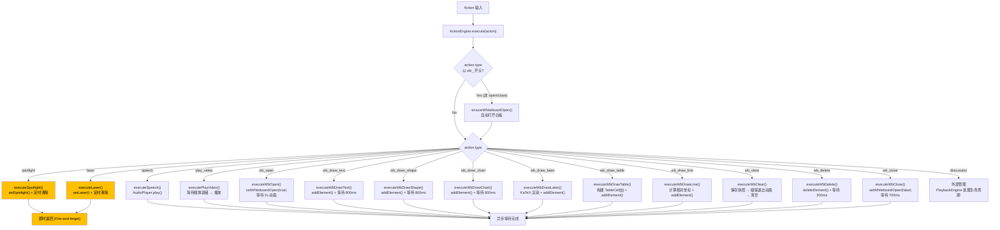

### 4.6 API 请求流程

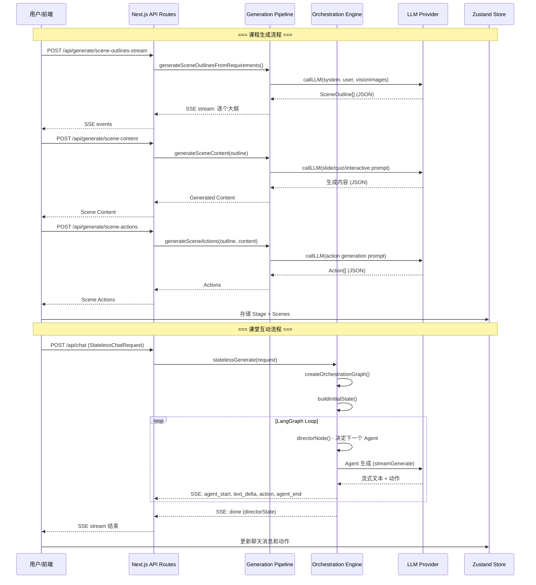

---

## 5. 核心模块详细设计

### 5.1 生成管线 (`lib/generation/`)

两阶段管线将用户需求转化为完整的交互式课堂。

#### 5.1.1 模块组成

| 文件 | 职责 | 主要方法 |
|------|------|---------|
| [pipeline-runner.ts](file:///Volumes/S990PRO/projects/OpenMAIC/lib/generation/pipeline-runner.ts) | 顶层管线编排 | `createGenerationSession()`, `runGenerationPipeline()` |
| [outline-generator.ts](file:///Volumes/S990PRO/projects/OpenMAIC/lib/generation/outline-generator.ts) | Stage 1: 需求→大纲 | `generateSceneOutlinesFromRequirements()`, `applyOutlineFallbacks()` |
| [scene-generator.ts](file:///Volumes/S990PRO/projects/OpenMAIC/lib/generation/scene-generator.ts) | Stage 2: 大纲→内容+动作 | `generateFullScenes()`, `generateSceneContent()`, `generateSceneActions()`, `createSceneWithActions()` |
| [scene-builder.ts](file:///Volumes/S990PRO/projects/OpenMAIC/lib/generation/scene-builder.ts) | 场景构建 (无 store 依赖) | `buildSceneFromOutline()`, `buildCompleteScene()`, `uniquifyMediaElementIds()` |
| [action-parser.ts](file:///Volumes/S990PRO/projects/OpenMAIC/lib/generation/action-parser.ts) | 动作解析 | `parseActionsFromStructuredOutput()` |
| [json-repair.ts](file:///Volumes/S990PRO/projects/OpenMAIC/lib/generation/json-repair.ts) | JSON 修复 | `parseJsonResponse()`, `tryParseJson()` |
| [prompt-formatters.ts](file:///Volumes/S990PRO/projects/OpenMAIC/lib/generation/prompt-formatters.ts) | Prompt 格式化 | `buildCourseContext()`, `formatAgentsForPrompt()`, `formatTeacherPersonaForPrompt()` |
| [pipeline-types.ts](file:///Volumes/S990PRO/projects/OpenMAIC/lib/generation/pipeline-types.ts) | 管线类型定义 | `AgentInfo`, `SceneGenerationContext`, `GenerationCallbacks`, `AICallFn` |
| [interactive-post-processor.ts](file:///Volumes/S990PRO/projects/OpenMAIC/lib/generation/interactive-post-processor.ts) | 交互式页面后处理 | `postProcessInteractiveHtml()` |

#### 5.1.2 Stage 1: 大纲生成

**入口方法**: `generateSceneOutlinesFromRequirements()`

**处理流程**:
1. 构建可用图片描述（支持 Vision 模式和纯文本模式）
2. 构建用户画像 (nickname + bio) 注入 Prompt
3. 构建媒体生成策略（根据是否启用 image/video 生成）
4. 调用 `buildPrompt(REQUIREMENTS_TO_OUTLINES, variables)` 构建完整 Prompt
5. `aiCall(system, user, visionImages)` 调用 LLM
6. `parseJsonResponse()` 解析响应
7. 为每个大纲补充 `id` / `order` / `language`
8. `uniquifyMediaElementIds()` 为媒体占位符生成全局唯一 ID

**输出**: `SceneOutline[]` — 每个元素描述一个场景的类型、标题、描述、关键要点等

#### 5.1.3 Stage 2: 场景内容生成

**入口方法**: `generateFullScenes()`

- 使用 `Promise.all()` **并行**生成所有场景
- 每个场景分两步生成：

**Step 1 — `generateSceneContent()`**: 根据场景类型分发

| 场景类型 | 生成函数 | 输出 |
|----------|---------|------|
| `slide` | `generateSlideContent()` | `PPTElement[]` + `SlideBackground` |
| `quiz` | `generateQuizContent()` | `QuizQuestion[]` |
| `interactive` | `generateInteractiveContent()` | `ScientificModel` + `HTML` |
| `pbl` | `generatePBLSceneContent()` | `PBLProjectConfig` |

**Step 2 — `generateSceneActions()`**: 生成教学动作序列 (speech, spotlight, whiteboard 等)

**重要内部方法**:
- `fixElementDefaults()` — 补充 AI 可能遗漏的必要字段 (line.points, text.defaultFontName 等)
- `processLatexElements()` — 使用 KaTeX 将 LaTeX 公式渲染为 HTML
- `resolveImageIds()` — 将 `img_1` 等 ID 解析为实际 base64 URL 或保留 `gen_img_*` 占位符
- `normalizeQuizOptions()` — 标准化测验选项格式 `{value, label}`
- `normalizeQuizAnswer()` — 标准化答案格式

### 5.2 多智能体编排引擎 (`lib/orchestration/`)

基于 LangGraph StateGraph 的多智能体编排系统。

#### 5.2.1 模块组成

| 文件 | 职责 | 主要方法 |
|------|------|---------|
| [director-graph.ts](file:///Volumes/S990PRO/projects/OpenMAIC/lib/orchestration/director-graph.ts) | LangGraph 状态图 | `createOrchestrationGraph()`, `buildInitialState()`, `directorNode()`, `agentGenerateNode()` |
| [stateless-generate.ts](file:///Volumes/S990PRO/projects/OpenMAIC/lib/orchestration/stateless-generate.ts) | 无状态流式生成 | `statelessGenerate()`, `parseStructuredChunk()`, `createParserState()`, `finalizeParser()` |
| [director-prompt.ts](file:///Volumes/S990PRO/projects/OpenMAIC/lib/orchestration/director-prompt.ts) | Director Prompt 构建 | `buildDirectorPrompt()`, `parseDirectorDecision()` |
| [prompt-builder.ts](file:///Volumes/S990PRO/projects/OpenMAIC/lib/orchestration/prompt-builder.ts) | Agent Prompt 构建 | `buildStructuredPrompt()`, `summarizeConversation()`, `convertMessagesToOpenAI()` |
| [tool-schemas.ts](file:///Volumes/S990PRO/projects/OpenMAIC/lib/orchestration/tool-schemas.ts) | 动作工具 Schema | `getEffectiveActions()` |
| [ai-sdk-adapter.ts](file:///Volumes/S990PRO/projects/OpenMAIC/lib/orchestration/ai-sdk-adapter.ts) | AI SDK ↔ LangGraph 适配器 | `AISdkLangGraphAdapter` |

#### 5.2.2 Director Graph 拓扑

```
START → director ──(end)──→ END
           │
           └─(next)→ agent_generate ──→ director (loop)
```

**Director 决策策略**:

| 条件 | 策略 |
|------|------|
| 单 Agent, turn 0 | 纯代码逻辑: 直接派遣唯一 Agent |
| 单 Agent, turn 1+ | 纯代码逻辑: 提示用户发言 (`cue_user`) |
| 多 Agent, turn 0 + trigger | 快速通道: 派遣触发 Agent (跳过 LLM) |
| 多 Agent, 其他 | LLM 决策: 选择下一个 Agent / USER / END |
| 任意, turnCount >= maxTurns | 结束 |

#### 5.2.3 SSE 事件类型

| 事件类型 | 数据 | 描述 |
|----------|------|------|
| `thinking` | `{stage, agentId?}` | 思考中 / 加载 Agent |
| `agent_start` | `{messageId, agentId, agentName, agentAvatar, agentColor}` | Agent 开始回应 |
| `text_delta` | `{content, messageId}` | 文本内容增量 |
| `action` | `{actionId, actionName, params, agentId, messageId}` | 动作事件 |
| `agent_end` | `{messageId, agentId}` | Agent 回应结束 |
| `cue_user` | `{fromAgentId?}` | 提示用户发言 |
| `done` | `{totalActions, totalAgents, agentHadContent, directorState}` | 生成完成 |
| `error` | `{message}` | 错误 |

#### 5.2.4 结构化输出解析

Agent 输出 JSON Array 格式：
```json
[
  {"type":"action","name":"spotlight","params":{"elementId":"img_1"}},
  {"type":"text","content":"Hello students..."},
  {"type":"action","name":"wb_draw_text","params":{"content":"公式","x":100,"y":100}},
  {"type":"text","content":"Now let me explain..."}
]
```

`parseStructuredChunk()` 实现增量解析:
1. 累积 buffer，找到 `[` 开始字符
2. 使用 `jsonrepair` + `partial-json` 解析
3. 区分完整项和部分项
4. 对完整项发送一次性事件
5. 对部分 text 项流式发送 delta

### 5.3 回放引擎 (`lib/playback/`)

驱动课堂回放和实时讨论的统一状态机。

#### 5.3.1 模块组成

| 文件 | 职责 | 主要方法 |
|------|------|---------|
| [engine.ts](file:///Volumes/S990PRO/projects/OpenMAIC/lib/playback/engine.ts) | 回放状态机 | `PlaybackEngine` 类 |
| [types.ts](file:///Volumes/S990PRO/projects/OpenMAIC/lib/playback/types.ts) | 类型定义 | `EngineMode`, `TriggerEvent`, `PlaybackEngineCallbacks` |
| [derived-state.ts](file:///Volumes/S990PRO/projects/OpenMAIC/lib/playback/derived-state.ts) | 派生状态 | 从 engine 状态计算 UI 状态 |

#### 5.3.2 状态机说明

| 状态 | 描述 | 可转换到 |
|------|------|---------|
| `idle` | 空闲/待机 | `playing` |
| `playing` | 正在回放教学内容 | `paused`, `live`, `idle` |
| `paused` | 暂停 | `playing`, `live` |
| `live` | 实时讨论模式 | `paused`, `idle` |

#### 5.3.3 核心方法

| 方法 | 操作 | 说明 |
|------|------|------|
| `start()` | idle → playing | 从头开始回放 |
| `continuePlayback()` | idle → playing | 从当前位置继续 |
| `pause()` | playing/live → paused | 暂停 TTS/讨论 |
| `resume()` | paused → playing/live | 恢复回放/讨论 |
| `stop()` | → idle | 停止所有，重置 |
| `confirmDiscussion()` | playing → live | 用户加入讨论 |
| `skipDiscussion()` | playing → playing | 用户跳过讨论 |
| `handleEndDiscussion()` | live → idle | 结束讨论，恢复讲座 |
| `handleUserInterrupt()` | playing/paused → live | 用户打断讲座进入讨论 |

#### 5.3.4 processNext() 核心循环

`processNext()` 是回放引擎的核心方法，按序消费 `Scene.actions[]`:

1. **检查场景边界** — 新场景开头时触发 `onSceneChange` 回调
2. **获取当前动作** — `getCurrentAction()` 自动跨场景推进
3. **分类执行**:
   - `speech`: 播放 TTS 音频 → 等待完成 → processNext
   - `spotlight`/`laser`: 即时执行视觉效果 → 立即 processNext
   - `discussion`: 延迟 3s 后显示 ProactiveCard → 等待用户选择
   - `wb_*`: 通过 ActionEngine 同步执行白板操作 → processNext
4. **支持浏览器原生 TTS** — 分句播放避免 Chrome ~15s 截断 bug

### 5.4 动作引擎 (`lib/action/`)

统一的动作执行层，替代原先 28 个独立的 Vercel AI SDK tools。

#### 5.4.1 `ActionEngine` 类

| 方法 | 类别 | 描述 |
|------|------|------|
| `execute(action)` | 入口 | 统一分发动作执行 |
| `clearEffects()` | 工具 | 清除所有视觉效果 |
| `dispose()` | 清理 | 清理定时器 |
| `executeSpotlight()` | Fire-and-forget | 聚光灯效果，5s 自动清除 |
| `executeLaser()` | Fire-and-forget | 激光指针效果，5s 自动清除 |
| `executeSpeech()` | Synchronous | 播放 TTS 音频 |
| `executePlayVideo()` | Synchronous | 等待媒体就绪+播放视频 |
| `executeWbOpen()` | Synchronous | 打开白板，等待 2s 动画 |
| `executeWbDrawText()` | Synchronous | 在白板上绘制文本，等待 800ms |
| `executeWbDrawShape()` | Synchronous | 在白板上绘制形状，等待 800ms |
| `executeWbDrawChart()` | Synchronous | 绘制图表，等待 800ms |
| `executeWbDrawLatex()` | Synchronous | KaTeX 渲染 + 绘制公式，等待 800ms |
| `executeWbDrawTable()` | Synchronous | 构建 TableCell[][] + 绘制表格 |
| `executeWbDrawLine()` | Synchronous | 绘制线条/箭头 |
| `executeWbClear()` | Synchronous | 保存快照 → 级联退出动画 → 清空 |
| `executeWbDelete()` | Synchronous | 删除特定元素 |
| `executeWbClose()` | Synchronous | 关闭白板，等待 700ms |

#### 5.4.2 动作分类

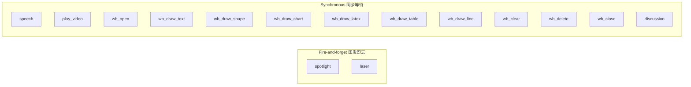

---

## 6. 数据模型

### 6.1 核心类型关系

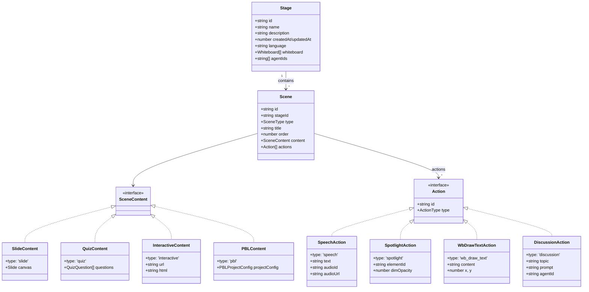

### 6.2 生成类型

| 类型 | 用途 |
|------|------|
| `UserRequirements` | 用户输入 (requirement 文本 + language) |
| `SceneOutline` | Stage 1 输出: 场景大纲 (type/title/description/keyPoints) |
| `GeneratedSlideContent` | Stage 2 输出: 幻灯片内容 (PPTElement[] + background) |
| `GeneratedQuizContent` | Stage 2 输出: 测验内容 (QuizQuestion[]) |
| `GeneratedInteractiveContent` | Stage 2 输出: 交互式内容 (HTML + ScientificModel) |
| `GeneratedPBLContent` | Stage 2 输出: PBL 内容 (PBLProjectConfig) |
| `GenerationSession` | 生成会话: id + progress + outlines |
| `GenerationProgress` | 生成进度: currentStage/overallProgress/statusMessage |

---

## 7. API 端点设计

### 7.1 生成相关

| 端点 | 方法 | 描述 |
|------|------|------|
| `/api/generate/scene-outlines-stream` | POST | SSE 流式生成场景大纲 |
| `/api/generate/scene-content` | POST | 生成单个场景内容 |
| `/api/generate/scene-actions` | POST | 生成场景动作序列 |
| `/api/generate/agent-profiles` | POST | 生成 Agent 配置 |
| `/api/generate/tts` | POST | TTS 语音合成 |
| `/api/generate/image` | POST | AI 图片生成 |
| `/api/generate/video` | POST | AI 视频生成 |
| `/api/generate-classroom` | POST | 提交异步课堂生成任务 |
| `/api/generate-classroom/[jobId]` | GET | 轮询任务状态 |

### 7.2 互动相关

| 端点 | 方法 | 描述 |
|------|------|------|
| `/api/chat` | POST | 多智能体对话 (SSE 流式) |
| `/api/quiz-grade` | POST | 测验评分 |
| `/api/pbl` | POST | PBL 项目互动 |
| `/api/transcription` | POST | 语音识别 |
| `/api/web-search` | POST | 网络搜索 |

### 7.3 工具相关

| 端点 | 方法 | 描述 |
|------|------|------|
| `/api/parse-pdf` | POST | PDF 解析 |
| `/api/classroom` | GET | 获取课堂数据 |
| `/api/classroom-media` | GET | 获取课堂媒体资源 |
| `/api/proxy-media` | GET | 媒体代理 |
| `/api/server-providers` | GET | 获取服务端配置的 Provider |
| `/api/verify-model` | POST | 验证模型可用性 |
| `/api/verify-image-provider` | POST | 验证图片提供者 |
| `/api/verify-video-provider` | POST | 验证视频提供者 |
| `/api/verify-pdf-provider` | POST | 验证 PDF 提供者 |
| `/api/health` | GET | 健康检查 |

---

## 8. 状态管理

### 8.1 Zustand Stores

| Store | 文件 | 主要状态 |
|-------|------|---------|
| **Stage Store** | [stage.ts](file:///Volumes/S990PRO/projects/OpenMAIC/lib/store/stage.ts) | Stage, Scenes, currentSceneId, mode |
| **Canvas Store** | [canvas.ts](file:///Volumes/S990PRO/projects/OpenMAIC/lib/store/canvas.ts) | spotlight, laser, whiteboardOpen, playingVideoElementId |
| **Settings Store** | [settings.ts](file:///Volumes/S990PRO/projects/OpenMAIC/lib/store/settings.ts) | provider, model, TTS, ASR, media, theme 等 43k 配置 |
| **Snapshot Store** | [snapshot.ts](file:///Volumes/S990PRO/projects/OpenMAIC/lib/store/snapshot.ts) | 撤销/重做快照 |
| **Keyboard Store** | [keyboard.ts](file:///Volumes/S990PRO/projects/OpenMAIC/lib/store/keyboard.ts) | 键盘快捷键状态 |
| **User Profile Store** | [user-profile.ts](file:///Volumes/S990PRO/projects/OpenMAIC/lib/store/user-profile.ts) | 用户昵称, 简介 |
| **Media Generation Store** | [media-generation.ts](file:///Volumes/S990PRO/projects/OpenMAIC/lib/store/media-generation.ts) | 图片/视频生成任务状态 |
| **Whiteboard History** | [whiteboard-history.ts](file:///Volumes/S990PRO/projects/OpenMAIC/lib/store/whiteboard-history.ts) | 白板历史快照 (撤销) |

### 8.2 数据持久化

- **IndexedDB (Dexie)**: 课堂数据 (Stage + Scenes) 本地存储
- **localStorage**: 用户设置 (Settings Store 持久化)

---

## 9. AI 层设计

### 9.1 LLM 抽象层 (`lib/ai/`)

| 文件 | 职责 |
|------|------|
| [llm.ts](file:///Volumes/S990PRO/projects/OpenMAIC/lib/ai/llm.ts) | 统一 LLM 调用层: `callLLM()` / `streamLLM()` |
| [providers.ts](file:///Volumes/S990PRO/projects/OpenMAIC/lib/ai/providers.ts) | 多提供者配置和模型注册 |
| [thinking-context.ts](file:///Volumes/S990PRO/projects/OpenMAIC/lib/ai/thinking-context.ts) | Thinking/Reasoning 上下文传递 |

### 9.2 支持的 Provider

| Provider | 模型示例 | Thinking 支持 |
|----------|---------|--------------|
| **OpenAI** | GPT-5, GPT-5.1, GPT-5.2, o-series | ✅ reasoningEffort |
| **Anthropic** | Claude 4.5, 4.6 | ✅ type: enabled/adaptive/disabled |
| **Google** | Gemini 3 Flash, 3.1 Pro | ✅ thinkingLevel / thinkingBudget |
| **DeepSeek** | DeepSeek-V3 | Via OpenAI-compatible |
| **Grok (xAI)** | Grok-2 | Via OpenAI-compatible |
| **Custom** | 任何 OpenAI-compatible API | Via baseUrl |

### 9.3 Thinking 适配器

`callLLM` / `streamLLM` 自动处理思维模式:
- **优先级**: 调用方 providerOptions > ThinkingConfig > 模型默认值
- **禁用**: `buildDisableThinking()` — 针对不同 provider 使用最低 effort/budget
- **启用**: `buildEnableThinking()` — 针对不同 provider 配置 budget/level
- **全局覆盖**: `LLM_THINKING_DISABLED=true` 环境变量

---

## 10. 支撑模块

### 10.1 音频模块 (`lib/audio/`)

| 文件 | 职责 |
|------|------|
| `tts-providers.ts` | TTS 提供者 (Azure, OpenAI, Google, 浏览器原生) |
| `asr-providers.ts` | ASR 语音识别提供者 |
| `voice-resolver.ts` | 语音解析器 |
| `browser-tts-preview.ts` | 浏览器原生 TTS 预览 |
| `constants.ts` | Azure 语音库 (24k 行配置) |

### 10.2 媒体模块 (`lib/media/`)

| 文件 | 职责 |
|------|------|
| `image-providers.ts` | 图片生成提供者 |
| `video-providers.ts` | 视频生成提供者 |
| `media-orchestrator.ts` | 媒体生成编排器 |
| `adapters/` | 各提供者的具体适配器 |

### 10.3 导出模块 (`lib/export/`)

| 文件 | 职责 |
|------|------|
| `use-export-pptx.ts` | PPTX 导出 Hook (42k 行复杂转换逻辑) |
| `latex-to-omml.ts` | LaTeX → Office Math 转换 |
| `svg-path-parser.ts` | SVG 路径解析 |
| `html-parser/` | HTML 到 PPTX 元素转换 |

### 10.4 PBL 模块 (`lib/pbl/`)

| 文件 | 职责 |
|------|------|
| `generate-pbl.ts` | PBL 项目内容生成 |
| `pbl-system-prompt.ts` | PBL 系统 Prompt |
| `mcp/` | MCP (Model Context Protocol) 集成 |
| `types.ts` | PBL 类型定义 |

---

## 11. 前端组件架构

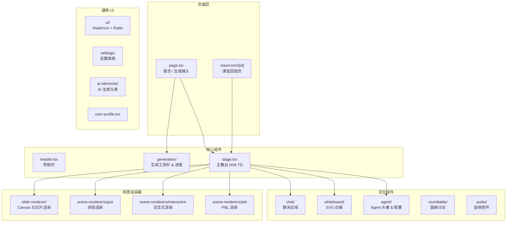

---

## 12. 安全与性能考虑

### 12.1 安全

- **无状态服务端**: 所有状态保存在客户端 (Zustand + IndexedDB)，服务端无需持久化
- **API Key 传递**: 客户端传入 API Key，不在服务端存储
- **AGPL-3.0 许可**: 开源合规

### 12.2 性能优化

- **并行场景生成**: `Promise.all()` 同时生成所有场景
- **流式传输**: SSE (Server-Sent Events) 实时推送生成进度
- **增量 JSON 解析**: `partial-json` + `jsonrepair` 流式解析不完整 JSON
- **延迟加载**: 白板、图表等组件按需加载
- **心跳保活**: SSE 连接 15s 心跳防止代理/浏览器超时断连
- **TTS 分句播放**: 避免 Chrome ~15s 截断 bug

### 12.3 容错

- **大纲类型回退**: `applyOutlineFallbacks()` — interactive 缺 config → slide，PBL 缺 config → slide
- **JSON 修复**: `jsonrepair` + `parsePartialJson` 双重容错
- **LLM 重试**: `callLLM()` 支持验证失败重试 (`LLMRetryOptions`)
- **流式解析回退**: `finalizeParser()` — 模型未产生有效 JSON 时将原始文本作为文本项发出

---

## 13. 部署架构

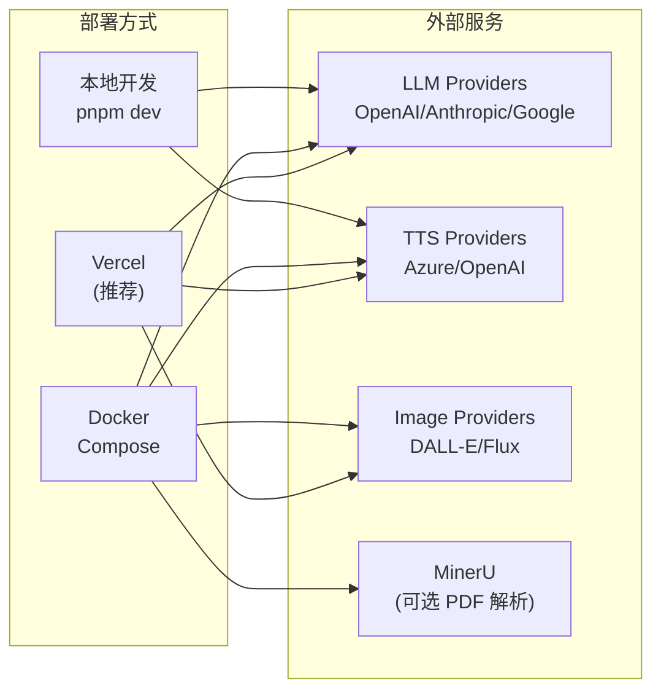

**环境变量**:
- `OPENAI_API_KEY` / `ANTHROPIC_API_KEY` / `GOOGLE_API_KEY` — LLM Provider Keys
- `DEFAULT_MODEL` — 默认模型 (推荐 `google:gemini-3-flash-preview`)
- `PDF_MINERU_BASE_URL` — MinerU PDF 解析地址 (可选)
- `LLM_THINKING_DISABLED` — 全局禁用 Thinking (可选)

---

> **文档生成时间**: 2026-03-25
> **分析基于**: OpenMAIC v0.1.0 源码
